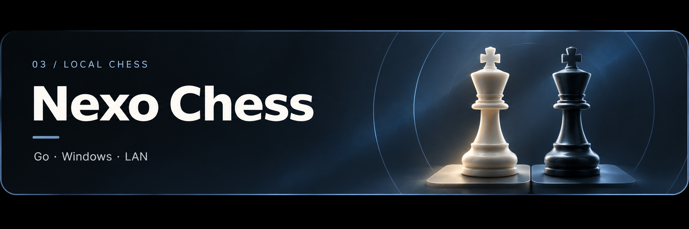

# Nexo Chess

**Español** | [English](README.en.md)

**Una misma red. Dos personas. Una partida.**

Nexo Chess es una aplicación gratuita y portátil para jugar al ajedrez con otra persona conectada a tu misma red local, como el Wi-Fi de casa. Solo el ordenador anfitrión ejecuta la aplicación; los demás entran desde el navegador de un PC, móvil o tableta.

No necesitas internet, una cuenta ni instalar programas adicionales. **La versión 1.0 es para partidas entre personas, sin reloj ni rival de inteligencia artificial.**

## Descargar y jugar

**[Descargar Nexo Chess 1.0 para Windows](https://github.com/LogicGrove/nexochess/releases/tag/v1.0.0)** · Windows 10/11 de 64 bits.

1. Descarga `NexoChess-1.0.0-Windows-x64.zip` y extrae su contenido.
2. Abre **`NexoChess.exe`**. Se abrirá tu navegador.
3. Escribe tu apodo, crea una mesa y elige blancas o negras.
4. Comparte la **dirección de red que muestra la app** con la otra persona.
5. La otra persona abre esa dirección en su navegador y entra en la misma mesa. Mantén la aplicación abierta en el ordenador anfitrión.

Si Windows solicita acceso a la red, permite Nexo Chess en tu **red privada**. Ambos dispositivos deben estar conectados a la misma red.

## Qué incluye

- Varias mesas, elección de color y acceso como espectador.
- Movimientos legales señalados, jaque, mate, ahogado y casos habituales de tablas.
- Enroque, captura al paso y coronación a dama, torre, alfil o caballo.
- Historial y rebobinado para revisar posiciones sin alterar la partida.
- Deshacer, reiniciar y acordar tablas con aceptación del rival.
- Exportación **PGN**, temas claro y oscuro, tablero giratorio y diseño adaptable.

**Las partidas se guardan solo en memoria y se borran al cerrar el programa. Exporta el PGN si quieres conservarlas.**

## Si el otro jugador no puede entrar

Usa la dirección que muestra tu app, evita el Wi-Fi de invitados y comprueba el permiso de Windows para redes privadas. Si usas una VPN, elige la dirección del adaptador Wi-Fi o Ethernet. No hace falta abrir puertos del router.

## Más información

- [Guía avanzada](docs/README.advanced.md): red, datos, límites, código y compilación.
- [Código original 1.0](https://github.com/LogicGrove/nexochess/releases/tag/v1.0.0): disponible también como ZIP en la release.
- [Licencia MIT](LICENSE) · [Avisos de terceros](THIRD_PARTY_NOTICES.txt).

Proyecto de **Manu / LogicGrove**. Las portadas son ilustraciones decorativas; la interfaz de la versión 1.0 está en español.
